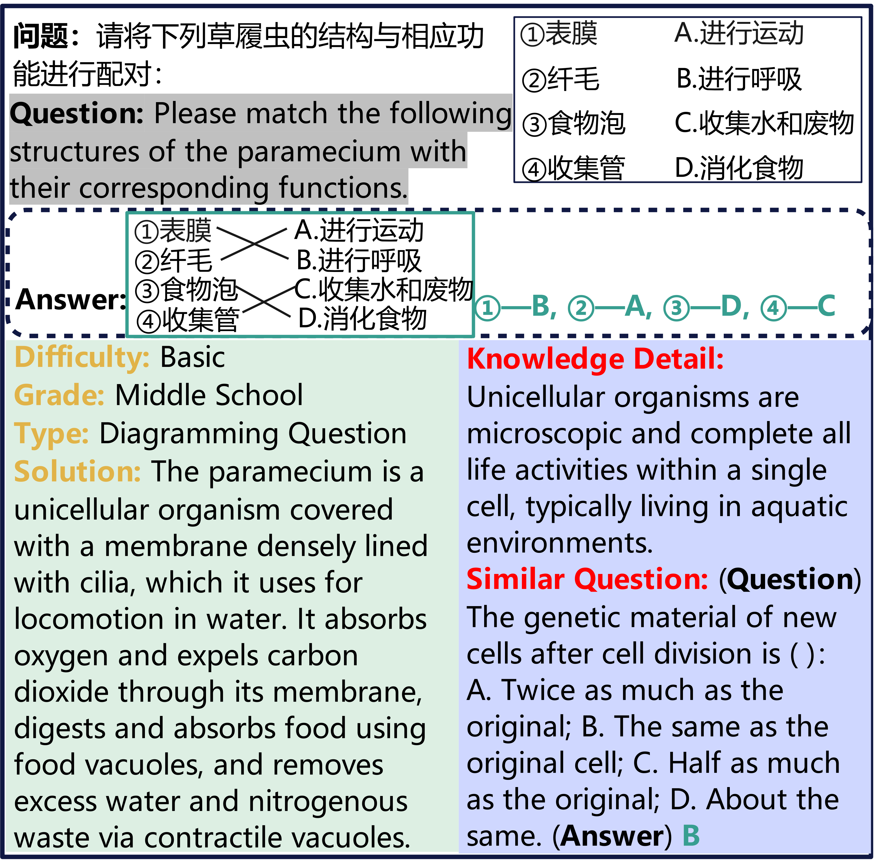
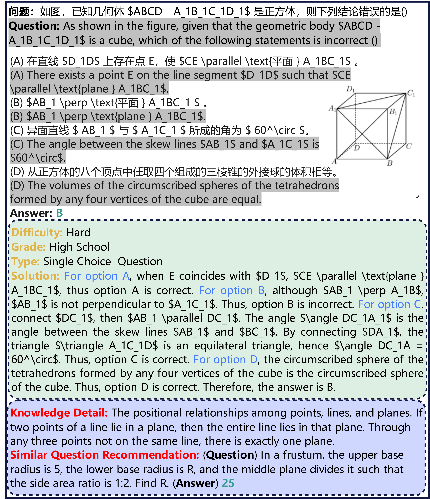

# EduQS

[**🤗 Dataset**](https://huggingface.co/datasets/chaosY/EduQS) | [**Paper**](https://your-paper-link.com)

This repository provides evaluation code and dataset details for the paper:

> **EduQS: A Comprehensive Benchmark for Evaluating Multi-Modal Large Language Models on Chinese Education Question Solving**


## 🔍 Introduction

**EduQS** is a large-scale Chinese multimodal educational dataset containing **52,056 questions**, spanning **7 question types** and **5 difficulty levels** across **6 subjects**: *Mathematics, Physics, Chemistry, Biology, Geography,* and *History*.

Each question includes:
- Multimodal **question description** (text + image)
- **Solution information** (difficulty, answer, full explanation)
- **Side information** (structured knowledge points and similar questions)

These features support fine-grained evaluation of MM-LLMs on **reasoning**, **in-context learning**, and **generalization**.
<p align="center">
  
  
  
</p>


## 📦 Dataset Format

Example (`.jsonl` format):

```json
{
  "subject": "biology",
  "id": "biology_799",
  "type": "fill-in-the-blank",
  "grade": "high",
  "difficulty": "hard",
  "question_info": "题干...",
  "solution_info": "解析...",
  "answer": "标准答案...",
  "side_information": [
    "辅助知识点1...",
    "辅助知识点2..."
  ],
  "image": {
    "path": "val/images/high_biology_799.png"
  }
}
```

---

## 📊 Evaluation

We evaluate MM-LLMs on answer accuracy and reasoning quality using both human-annotated judgments and automated metrics such as BLEU and ROUGE.
